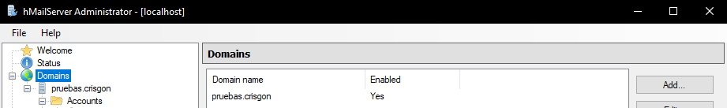
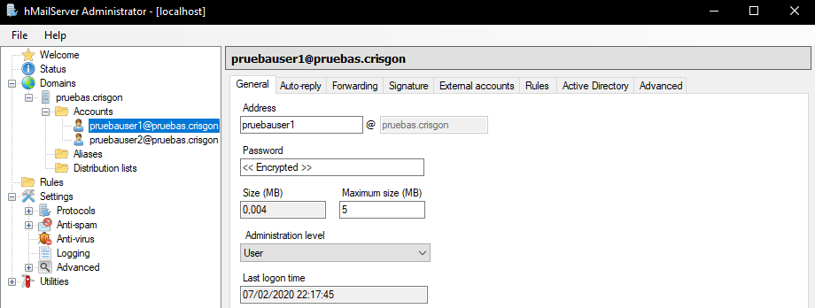
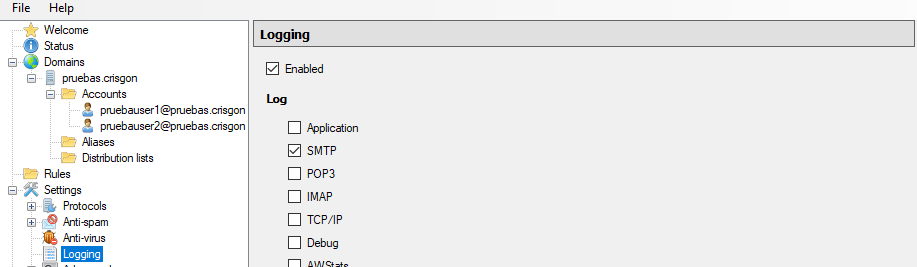
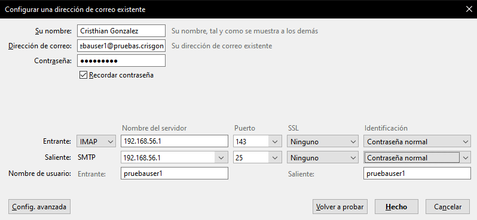
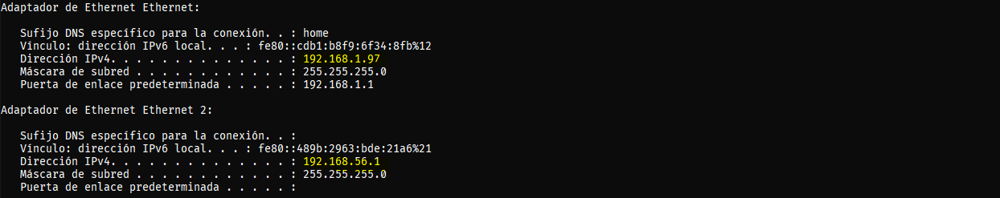
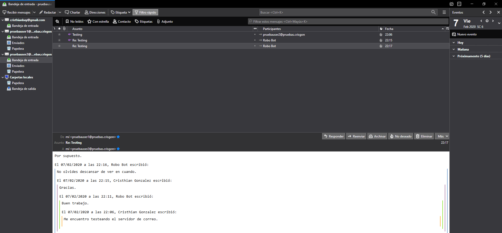
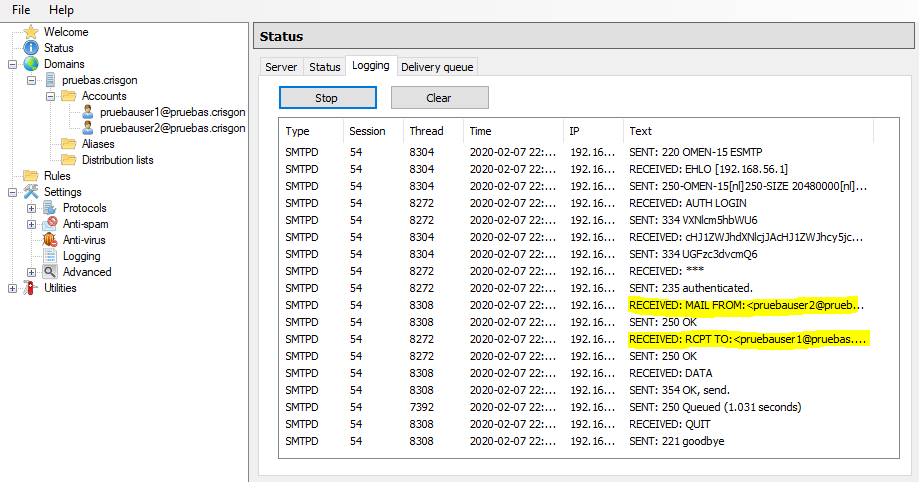

# COMUNICACIÓN CON SERVIDOR EMAIL

###### Alumno: Cristhian González
###### Módulo: Programación de servicios y procesos
###### Curso: 2º DAM


# INDICE

### [1. INTRODUCCIÓN](#1-introducci%C3%B3n)
### [2. CREANDO MI SERVIDOR DE CORREO](#2-creando-mi-servidor-de-correo-1)
### [3. PRUEBAS CON EL SERVIDOR DE CORREO](#3-pruebas-con-el-servidor-de-correo-1)
### [4. AUNTENTICANDO E-MAILS EN JAVA](#4-autenticando-e-mails-en-java)
### [5. ENVIANDO MAILS A TRAVES DE JAVA](#5-enviando-mails-a-través-de-java)
### [6. LEYENDO MAILS A TRAVES DE JAVA](#6-leyendo-mails-a-traves-de-java-1)

## 1. INTRODUCCIÓN

En esta pratica realizaré un programa en Java que permita enviar mails a través de un servidor de correo propio, se capturarán los mensajes que vaya mostrando el servidor. La cuenta de correo que envía un mail estará autenticada y utilizará el protocolo estándar SMTP (Port 25), dicho mail se enviará a una segunda cuenta de correo del servidor. Además realizaré un segundo programa en Java realizaré una consulta del mail mediante el protocolo IMAP (Port 143) y mostrará en pantalla un listado de los mails existentes en el buzón. Las herramientas de desarrollo que se utilizarán son Eclipse como IDE, Swing para el desarrollo de ventanas y la librería JavaMail para poder enviar correos. 

Además que nada quería añadir que mi programa está dividido en tres ventanas JFRAME, la primera será la de autenticación (LoginWindow) que se encarga de comprobar el usuario y contraseña introducidos, por otro lado tendré la bandeja de entrada la cual muestra los mensajes recibidos de la cuenta a la que estamos conectados (InboxWindow), y por utlimo la ventana que se encarga de enviar los correos (MessageWindow). 

## 2. CREANDO MI SERVIDOR DE CORREO

Para crear mi propio servidor de correo me he decantado por usar hMailServer, es de software libre y accesible, por otro lado como cliente de correo utilizaré Thunderbird para realizar las primera pruebas de funcionamiento del servidor. 

Primero mostraré un poco cómo he configurado mi servidor de correo, para así dar más detalle de como he realizado esta practica. Una vez descargue e instalé hMailServer tuve que crear un nuevo dominio personalizado la que he llamado “pruebas.crisgon”. 




A este dominio le he añadido un par de cuentas con las que estaré trabajando para realizar la práctica. A las que he llamado esta vez pruebasuser1@pruebas.crisgon y pruebasuser2@pruebas.crisgon, un nombre completamente valido, le he definido una configuración básica como la contraseña y  el tamaño máximo que puede llegar a almacenar (sí, no está a cero en la captura porque hice unas pruebas antes y estuve enviandome mensajes). Además en configuración avanzada se le ha dado un nombre a la cuenta, pero es solo indicativo.
En la siguiente captura se muestra un poco como luce la configuración de esta cuenta:



Por otro lado para poder luego ver el Log de lo que iba pasando en el servidor tuve que ir indagando un poco en la configuración (Settings) porque en un principio el registro en vivo o logging no me funcionaba, se ve no viene configurado por defecto. 

“If you have logging turned on, the Logging tab will show the log directly on the screen. It is not recommended to use live-logging when debug-logging is enabled. This is because the debug logging option will produce a large amount of log information. In versions of hMailServer prior to version 4.1, the live log does not work with terminal services. Also, in those versions the server needs to have access to desktop interaction for the live log to work.”

Por lo que tuve activarlo por mi cuenta en la opción de Settings → Logging donde debe marcarse como Enabled y marcar SMTP.



En principio con está configuración ya he podido empezar a usar mi servidor de correo, ahora en el siguiente apartado me conectaré a mis cuentas y me enviaré mensajes entre ellas para revisar que todo funciona correctamente. 

## 3. PRUEBAS CON EL SERVIDOR DE CORREO

Como cliente de correo electronico voy a utilizar Mozilla Thunderbird, ya que dispone de muchas opciones de configuración accesibles y no me ha costado conectarme a mis cuentas. Con el programa instalado, he tenido que añadir mis cuentas cuenta de manera manual indicandole el servidor, el tipo de conexión que utiliza, el puerto, entre otras cosas. En la siguiente captura se muestra como queda la configuración manual de la cuenta en Thunderbird.



En el puerto del servidor habrá utilizar la ip del equipo, esto se sabe haciendo un ipconfig en la cmd, hay que tener cuidado al coger la correcta, ya que cambiará si estamos por wifi o cable de red. Yo tenía un problema y era que mi portatil tenia asignadas dos IP Ethernet y estaba cogiendo la erronea y no podía ni conectarme a mis cuentas, cuando me di cuenta todo fue bien.



Una vez agregadas las dos cuentas a Thunderbird llego la hora de hacer pruebas, y que me mejor manera de enviarme correos con estas cuentas, eso hice y los resultados fueron positivos. Me dio para hacer un pequeña conversación y todo.



Además se ve reflejado en el Logging del servidor, además de otras acciones que realiza este, pero lo que destaca es lo que tengo marcado en amarillo.



Con esto di por finalizadas las pruebas y me puse con el programa en el que simulo un cliente de correo electronico. 

## 4. AUTENTICANDO E-MAILS EN JAVA

Como se ha mencionado anteriormente para poder enviar mails a través de un programa Java necesitaremos una librería llamada JavaMail la cual está desarrollada por Oracle, yo he utilizado la versión 1.4.5. Hay que añadir estas librerías al proyecto o bien utilizar Maven y agregar las dependencias al archivo pom.

A continuación dejo el código del programa donde explicaré a través de código lo que voy haciendo cuando lo vea conveniente.

Clase LoginWindow:

```java

import java.awt.BorderLayout;
import java.awt.Dimension;
import java.awt.EventQueue;
import java.awt.Toolkit;

import javax.swing.JFrame;
import javax.swing.JPanel;
import javax.swing.border.EmptyBorder;
import javax.mail.AuthenticationFailedException;
import javax.mail.MessagingException;
import javax.mail.PasswordAuthentication;
import javax.mail.Session;
import javax.mail.Transport;
import javax.swing.JButton;
import javax.swing.JLabel;
import javax.swing.JOptionPane;
import javax.swing.JTextField;
import javax.swing.JPasswordField;
import java.awt.event.ActionListener;
import java.util.Properties;
import java.awt.event.ActionEvent;

public class LoginWindow extends JFrame {

	private static final String TAG = "LoginWindow";
	private static Session session;
	private static String username;
	private static String password;
	
	private JPanel contentPane;
	private JTextField tfUsuario;
	private JPasswordField passwordField;

	public static void main(String[] args) {
		EventQueue.invokeLater(new Runnable() {
			public void run() {
				try {
					LoginWindow loginWindow = new LoginWindow();
					loginWindow.setVisible(true);
				} catch (Exception e) {
					e.printStackTrace();
				}
			}
		});
	}

	public LoginWindow() {

		setDefaultCloseOperation(JFrame.EXIT_ON_CLOSE);

		setBounds(100, 100, 256, 258);
		contentPane = new JPanel();
		contentPane.setBorder(new EmptyBorder(5, 5, 5, 5));
		setContentPane(contentPane);
		contentPane.setLayout(null);

		JButton btnSalir = new JButton("Salir");
		btnSalir.addActionListener(new ActionListener() {
			public void actionPerformed(ActionEvent arg0) {
				System.exit(0);
			}
		});
		btnSalir.setBounds(121, 159, 97, 25);
		contentPane.add(btnSalir);

		/** Botón a la escucha que se encarga de iniciar 
		 * sesión en mi servidor de correo y comprobar que la cuenta
		 * existe y la contraseña es correcta
		 * */
		JButton btnLogin = new JButton("Login");
		btnLogin.addActionListener(new ActionListener() {
			public void actionPerformed(ActionEvent e) {

				/** Necesitaremos crear una nueva instancia de la clase Properties y añadirle las propiedades */
				Properties props = new Properties();

				/** Añadidimos a la propiedads la propiedad que define el nombre a asignar y el host */
				props.setProperty("mail.smtp.host", "localhost");
				/** Si utilizamos tls tendremos que indicarlo con la siguiente propiedad */
				props.setProperty("mail.smtp.starttls.enable", "true");
				/** Indicar el puerto por el que se va a conectar, en mi caso el 25 */
				props.setProperty("mail.smtp.port", "25");
				/** Indiciar si se va autentificar directamente al servidor */
				props.setProperty("mail.smtp.auth", "true");

				/** Obtengo lo que ha introducido el usuario en los TextField 
				 * para comprobar que todo es correcto*/
				username = tfUsuario.getText();
				password = passwordField.getText();

				/** Obtengo una instancia de la clase Session a la que le pasaré las propiedades y un 
				 * nuevo Autenticator, el cual se encargará de validar el usuario y la contraseña */
				session = Session.getInstance(props, new javax.mail.Authenticator() {
					protected PasswordAuthentication getPasswordAuthentication() {
						return new PasswordAuthentication(username, password);
					}
				});

				/** A la hora de capturar la excepción por si la contraseña no es incorrecta he 
				 * tenido que usar la clase Transport para conectarme al servidor y la excepción 
				 * AuthenticationFailedException para controlar dicha excepción y mostrar un mensaje en caso 
				 * de que nosea correcta. */
				try {
					Transport transport = session.getTransport("smtp");
					transport.connect("localhost", username, password);
					transport.close();
					
					/** La contraseña introducida es correcta, así que 
					 * no salta la excepción y abro la bandeja de entrada. */

					JOptionPane.showMessageDialog(null, "Bienvenido, ha accedido a su cuenta de correo correctamente.",
							"Sesión iniciada", JOptionPane.INFORMATION_MESSAGE);

					EventQueue.invokeLater(new Runnable() {
						public void run() {
							try {
								InboxWindow inboxWindow = new InboxWindow();
								inboxWindow.setVisible(true);
							} catch (Exception e) {
								e.printStackTrace();
							}
						}
					});

					dispose();

				} catch (AuthenticationFailedException ae) {
					/** El usuario o contraseña no son correctos, por lo que salta la siguiente ventana. */
					JOptionPane.showMessageDialog(null,
							"El usuario y la contraseña parecen no coincidir. Inténtelo de nuevo.",
							"Error al iniciar sesión", JOptionPane.WARNING_MESSAGE);
				} catch (MessagingException me) {
					me.printStackTrace();
				}
			}
		});

		btnLogin.setBounds(12, 159, 97, 25);
		contentPane.add(btnLogin);

		JLabel lblUsuario = new JLabel("Usuario:");
		lblUsuario.setBounds(12, 63, 72, 16);
		contentPane.add(lblUsuario);

		JLabel lblContrasea = new JLabel("Contrase\u00F1a:");
		lblContrasea.setBounds(12, 109, 72, 16);
		contentPane.add(lblContrasea);

		tfUsuario = new JTextField();
		tfUsuario.setBounds(102, 60, 116, 22);
		contentPane.add(tfUsuario);
		tfUsuario.setColumns(10);

		passwordField = new JPasswordField();
		passwordField.setBounds(102, 106, 116, 22);
		contentPane.add(passwordField);

		JLabel lblIniciarSesin = new JLabel("INICIAR SESI\u00D3N");
		lblIniciarSesin.setBounds(12, 13, 109, 16);
		contentPane.add(lblIniciarSesin);
	}

	/** Metodo estatico para obtener la sesión a 
	 * la hora de enviar un mensaje en la ventana MessageWindow */
	public static Session GetSesion() {
		return session;
	}
	
	/** Metodo estatico para obtener el usuario a 
	 * la hora de enviar un mensaje en la ventana MessageWindow */
	public static String GetUsername() {
		return username;
	}
	
	/** Metodo estatico para obtener la contraseña a 
	 * la hora de enviar un mensaje en la ventana MessageWindow */
	public static String GetPassword() {
		return password;
	}

}

```
## 5. ENVIANDO MAILS A TRAVÉS DE JAVA

En esta enviaré mensajes através de mi servidor SMTP para ello haré de las clases MimeMessage
y Transport. Más detalles comentados en el código.

Clase MessageWindow: 

```java
import java.awt.BorderLayout;
import java.awt.EventQueue;

import javax.swing.JFrame;
import javax.swing.JPanel;
import javax.swing.JPasswordField;
import javax.swing.border.EmptyBorder;
import javax.mail.Message;
import javax.mail.MessagingException;
import javax.mail.Session;
import javax.mail.Transport;
import javax.mail.internet.AddressException;
import javax.mail.internet.InternetAddress;
import javax.mail.internet.MimeMessage;
import javax.swing.JButton;
import javax.swing.JLabel;
import javax.swing.JOptionPane;
import javax.swing.JTextPane;
import javax.swing.JTextField;
import java.awt.event.ActionListener;
import java.util.Properties;
import java.awt.event.ActionEvent;

public class MessageWindow extends JFrame {

	private static final String TAG = "MessageWindow";
	
	private JPanel contentPane;
	private JTextField tfTo;
	private JTextField tfSubject;
	private JTextPane tpContent;

	public MessageWindow() {
		setDefaultCloseOperation(JFrame.DISPOSE_ON_CLOSE);
		setLocationRelativeTo(null);
		setBounds(100, 100, 450, 300);
		contentPane = new JPanel();
		contentPane.setBorder(new EmptyBorder(5, 5, 5, 5));
		setContentPane(contentPane);
		contentPane.setLayout(null);

		/** Botón a la escucha que se encarga de enviar los mensajes al correo
		 *  deseado, en mi caso pruebauser2 o pruebauser1.
		 * */
		JButton btnEnviar = new JButton("Enviar");
		btnEnviar.addActionListener(new ActionListener() {
			public void actionPerformed(ActionEvent arg0) {

				/** Cuando el usuario pulse en el botón
				 * 	Se obtendrá la sesión que uso en la ventana LoginWindow
				 */
				try {
					Session session = LoginWindow.GetSesion();
					
					/** Además obtendrá el usuario y la contraseña anteriormente insertadas.*/
					String remitter = LoginWindow.GetUsername();
					String password = LoginWindow.GetPassword();
					/** Por otro lado almaceno en variables lo que el usuario ha escrito en los TextField.*/
					String receiver = tfTo.getText();
					String subject = tfSubject.getText();
					String message = tpContent.getText();

					/** Se debe crear una clase MimeMessage para enviar el mensaje a la que le pasaremos la sesión.*/
					MimeMessage mimeMessage = new MimeMessage(session);

					/** Se ha de añadir la información necesaria a este mimeMessage para que pueda enviar el mensaje.*/
					mimeMessage.setFrom(new InternetAddress(remitter));
					mimeMessage.addRecipient(Message.RecipientType.TO, new InternetAddress(receiver));
					mimeMessage.setSubject(subject);
					mimeMessage.setText(message);
					
					/** Utilizo la clase transport para finalmente enviar el mimeMessage con el metodo sendMessage.*/
					Transport transport = session.getTransport("smtp");
					transport.connect(remitter, password);
					transport.sendMessage(mimeMessage, mimeMessage.getRecipients(Message.RecipientType.TO));
					transport.close();
					
					/** Si todo ha ido bien saltará el siguiente dialogo y se cerrará la ventana. */
					JOptionPane.showMessageDialog(null, "Se ha enviado el correo correctamente.");
					dispose();
					
				} catch (AddressException e) {
					e.printStackTrace();
				} catch (MessagingException e) {
					e.printStackTrace();
				}

			}
		});
		
		/** El siguiente contenido solo son los elementos 
		 * añadididos al diseño de la aplicación. */
		
		btnEnviar.setBounds(214, 215, 97, 25);
		contentPane.add(btnEnviar);

		JLabel lblPara = new JLabel("Para:");
		lblPara.setBounds(12, 37, 55, 16);
		contentPane.add(lblPara);

		JLabel lblAsunto = new JLabel("Asunto:");
		lblAsunto.setBounds(12, 79, 56, 16);
		contentPane.add(lblAsunto);

		tpContent = new JTextPane();
		tpContent.setBounds(12, 111, 408, 91);
		contentPane.add(tpContent);

		tfTo = new JTextField();
		tfTo.setBounds(52, 34, 368, 22);
		contentPane.add(tfTo);
		tfTo.setColumns(10);

		tfSubject = new JTextField();
		tfSubject.setBounds(62, 76, 358, 22);
		contentPane.add(tfSubject);
		tfSubject.setColumns(10);

		JLabel lblMensajeNuevo = new JLabel("MENSAJE NUEVO");
		lblMensajeNuevo.setBounds(11, 8, 98, 16);
		contentPane.add(lblMensajeNuevo);

		JButton btnCancelar = new JButton("Cancelar");
		btnCancelar.setBounds(323, 215, 97, 25);
		contentPane.add(btnCancelar);
	}
	
}
```

## 6. LEYENDO MAILS A TRAVES DE JAVA

La siguiente clase define la bandeja de entrada de mi programa, donde se muestran todos los
mensajes de la cuenta y su contenido. Para la lectura de mails tendremos que crear unas nuevas
propiedades para conectarnos atraves de IMAP por el puerto 143. Más detalles comentados en el
código.

```java
import java.awt.BorderLayout;
import java.awt.EventQueue;

import javax.swing.JFrame;
import javax.swing.JPanel;
import javax.swing.border.EmptyBorder;
import javax.swing.event.ListSelectionEvent;
import javax.swing.event.ListSelectionListener;
import javax.mail.Address;
import javax.mail.Folder;
import javax.mail.Message;
import javax.mail.MessagingException;
import javax.mail.NoSuchProviderException;
import javax.mail.Session;
import javax.mail.Store;
import javax.swing.DefaultListModel;
import javax.swing.JButton;
import javax.swing.JList;
import javax.swing.JLabel;
import java.awt.event.ActionListener;
import java.io.BufferedReader;
import java.io.IOException;
import java.io.InputStreamReader;
import java.util.Properties;
import java.awt.event.ActionEvent;
import javax.swing.JTextArea;
import javax.swing.JScrollPane;

public class InboxWindow extends JFrame {

	private static final String TAG = "InboxWindow";

	private JPanel contentPane;

	private Message[] messages;
	private JList messageList;
	private JTextArea textArea;

	private Store store;
	private Folder inbox;

	private String username;
	private String password;

	public InboxWindow() {
		setDefaultCloseOperation(JFrame.EXIT_ON_CLOSE);
		setBounds(100, 100, 637, 374);
		contentPane = new JPanel();
		contentPane.setBorder(new EmptyBorder(5, 5, 5, 5));
		setContentPane(contentPane);
		contentPane.setLayout(null);

		/** Obtengo la sesión y contraseña para poder trabajar con 
		 * ellas y no tener que pedirsela constantemente al usuario */
		username = LoginWindow.GetUsername();
		password = LoginWindow.GetPassword();

		/** Esto es solo un aditivo en el que muestro que sesión está iniciada en ese momento */
		JLabel lblHaIniciadoSesin = new JLabel("Sesi\u00F3n iniciada: " + LoginWindow.GetUsername());
		lblHaIniciadoSesin.setBounds(320, 14, 284, 14);
		contentPane.add(lblHaIniciadoSesin);

		/** Dentro de un bloque try ... catch necesitaré crear unas nuevas propiedades para conectarme
		 * a mi servidor mediante IMAP para poder leer los correos. */
		try {
			Properties properties = new Properties();
			/** Defino el protocol, en mi caso IMAP */
			properties.put("mail.store.protocol", "imap");
			/** Defino el host, en mi caso al tener un servidor de correo propio pongo localhost */
			properties.put("mail.imap.host", "localhost");
			/** Defino el puerto, que por defecto es el 143 */
			properties.put("mail.imap.port", "143");
			/**  Indicar que utilizamos tls */
			properties.put("mail.imap.starttls.enable", "true");

			/** Dado que ya tengo una sesión creada en la ventana de Login, obtengo 
			 * esa sesión atraves de mi metodo estatico GETSESSION()*/
			Session session = LoginWindow.GetSesion();
			/** Se necesita un objeto Store y Folder definidos en las propiedades de 
			 * la clase para obtener los correos */
			store = session.getStore("imap");
			store.connect("localhost", 143, username, password);
			/** Con esto obtenemos la carpeta INBOX, la cual almacenamos en nuestro objeto Folder.*/
			inbox = store.getFolder("INBOX");
			inbox.open(Folder.READ_ONLY);

			/** Guardamos los mensajes de la carpeta/folder en un vector de mensajes definido 
			 * tambien en las propiedades de la clase*/
			messages = inbox.getMessages();

			/** Botón a la escucha que nos permitirá acceder a la ventana de nuevo mensaje */
			JButton btnNuevoMensaje = new JButton("NUEVO MENSAJE");
			btnNuevoMensaje.addActionListener(new ActionListener() {
				public void actionPerformed(ActionEvent arg0) {
					EventQueue.invokeLater(new Runnable() {
						public void run() {
							try {
								MessageWindow messageWindow = new MessageWindow();
								messageWindow.setVisible(true);
							} catch (Exception e) {
								e.printStackTrace();
							}
						}
					});
				}
			});

			/** Botón a la escucha con el que podremos salir del programa */
			JButton btnSalir = new JButton("SALIR");
			btnSalir.addActionListener(new ActionListener() {
				public void actionPerformed(ActionEvent arg0) {
					/** Cuando terminar habrá que cerrar las conexiones a la clase Folder y Store. */
					try {
						inbox.close(false);
						store.close();
					} catch (MessagingException e) {
						// TODO Auto-generated catch block
						e.printStackTrace();
					}
					System.exit(0);
				}
			});
			btnSalir.setBounds(522, 295, 82, 25);
			contentPane.add(btnSalir);
			btnNuevoMensaje.setBounds(372, 295, 140, 25);
			contentPane.add(btnNuevoMensaje);

			/** Defino una area de Texto donde se mostrara el contenido de los mensajes */
			textArea = new JTextArea();
			textArea.setBounds(219, 42, 392, 242);
			contentPane.add(textArea);

			/** Defino un modelo de lista donde obtengo cada mensaje de la cuenta para 
			 * luego mostrarlo en un JList */
			DefaultListModel model = new DefaultListModel<>();
			for (int i = 0; i < messages.length; i++) {
				model.addElement("<html>" + "<body>" + "De: " + messages[i].getFrom()[0].toString() + "<br>"
						+ "Subject:" + messages[i].getSubject() + "</body></html>");

			}

			/** Creo el JList y le defino el modelo implementado anteriormente */
			messageList = new JList();
			messageList.setBounds(12, 42, 197, 278);
			contentPane.add(messageList);
			messageList.setModel(model);
			/** Pongo el JList a la escucha de evento para que al precionar uno de los elementos del JList 
			 * muetro en el textArea una vista más detallada de los mensajes. */
			messageList.addListSelectionListener(new ListSelectionListener() {

				@Override
				public void valueChanged(ListSelectionEvent e) {
					// TODO Auto-generated method stub
					int index = messageList.getSelectedIndex();
					try {
						textArea.setText("De: " + messages[index].getFrom()[0].toString() + "\n" + "Asunto: "
								+ messages[index].getSubject() + "\n" + "Contenido: \n" + messages[index].getContent());
					} catch (MessagingException | IOException e1) {
						// TODO Auto-generated catch block
						e1.printStackTrace();
					}
				}
			});

		} catch (NoSuchProviderException e) {
			e.printStackTrace();
		} catch (MessagingException e) {
			e.printStackTrace();
		} catch (Exception e) {
			e.printStackTrace();
		}

		JLabel lblEntrada = new JLabel("BANDEJA DE ENTRADA");
		lblEntrada.setBounds(12, 13, 129, 16);
		contentPane.add(lblEntrada);

		JScrollPane scrollPane = new JScrollPane();
		scrollPane.setBounds(219, 81, 141, -65);
		contentPane.add(scrollPane);

	}
}

```
